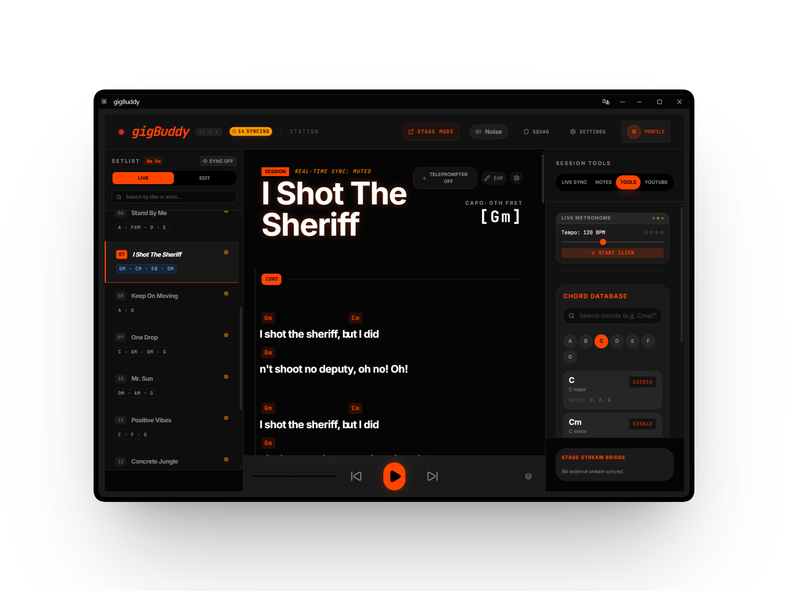

# 🎸 gigBuddy



The ultimate real-time live music dashboard. Sync setlists, lyrics, and chords, and control Spotify/YouTube Music playback directly from the stage with your band.

## 📱 Progressive Web App (PWA)
**gigBuddy** is designed to work everywhere. It runs as a **Progressive Web App**, meaning you can install it directly on your devices for a native app experience:

-   **💻 Desktop/PC**: Install via Chrome/Edge (click the install icon in the address bar).
-   **📱 Mobile (iOS/Android)**: "Add to Home Screen" from your mobile browser.
-   **📟 Tablets**: Perfect for stage-view use, fully responsive and touch-optimized.
-   **📶 Offline Support**: Access your cached setlists even when the venue's Wi-Fi fails.

## 🚀 Getting Started

### Prerequisites
- Node.js (v18 or higher)
- A Firebase Project
- (Optional) Spotify Developer Account for Spotify integration
- (Optional) Google Cloud Project for YouTube integration

### Setup Instructions

1. **Clone the repository:**
   ```bash
   git clone <your-repo-url>
   cd gigbuddy
   ```

2. **Install dependencies:**
   ```bash
   npm install
   ```

3. **Configure Environment Variables:**
   - Copy `.env.example` to `.env.local`:
     ```bash
     cp .env.example .env.local
     ```
   - Fill in your credentials in `.env.local`. You will need:
     - **Firebase**: Create a project at [Firebase Console](https://console.firebase.google.com/). Enable Authentication (Google & Anonymous) and Firestore.
     - **Spotify**: Create an app at [Spotify Developer Dashboard](https://developer.spotify.com/dashboard).
     - **YouTube**: Get an API Key from [Google Cloud Console](https://console.cloud.google.com/).

4. **Firebase Rules:**
   - Use the provided `firestore.rules` and `firebase-blueprint.json` (as a guide for the database structure) to set up your Firestore security rules and initial data.

5. **Run the app locally:**
   ```bash
   npm run dev
   ```

## 🛠️ Deployment

This app is ready to be deployed to platforms like Vercel, Netlify, or Firebase Hosting. Ensure you set the same environment variables from `.env.local` in your deployment platform's settings.

## 📄 License

This project is licensed under the Apache License 2.0 - see the [LICENSE](LICENSE) file for details.
